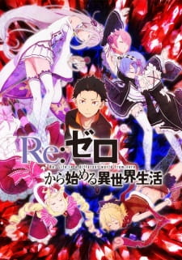

# Derek Hwang's CSE 110 Lab 1 Webpage

#### **About Me**

Hi! I'm Derek Hwang, a *2nd year CS student at UCSD*.

One very meaningful phrase that I thought was pretty good (that I saw on Slack) is:
 > Measure twice cut once
  
And to that, I hope that I can follow it. I have to remind myself to not get too ahead of myself while coding...

If you're interested in what I do outside of programming, check out this [section](#interests-outside-of-programming) 


#### **CSE 110 Lab 1**
As for the first lab, I used multiple commands from git including: 
```
git clone
git add
git commit
git push
```

It's been a little while so i had to refresh myself.

For more information, I'd reccommend checking out the [README file](README.md)


#### **Outside of CSE 110**
For the past year, I've been doing some research into teaching techniques with [Professor Adalbert Gerald Soosai Raj](https://adalbertgerald.github.io/) 

If you're interseted, you can read one of my papers on Live Coding [here!](https://dl.acm.org/doi/10.1145/3441636.3442317)


#### **Interests Outside of Programming**
I'm quite a big fan of Anime and Manga. For those interested, I've gone ahead and listed a few reccomendations below

1. Mushoku Tensei: Jobless Reincarnation
2. Moriarty The Patriot
3. So I'm a Spider, So What?


As you may have realized, 2 of the suggestions there are Isekai (another world) type animes. In general, the genres I enjoy are:

- Isekai (another world)
- Fantasy
- Action


Last Season (wi21) I watched the following (marked are completed):
- [x] Mushoku Tensei 
- [ ] So I'm a Spider, So What? 
- [x] Re:Zero Season 2 Part 2 

